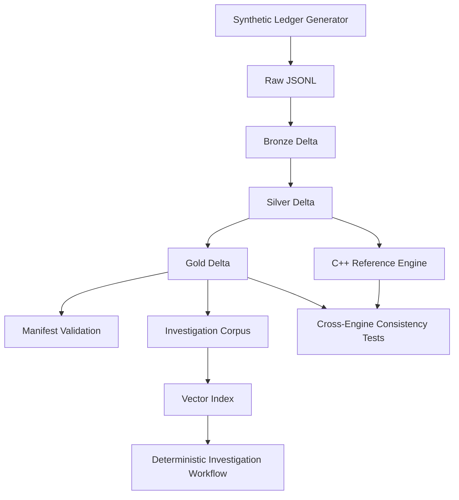

# FinSignal Lakehouse

**Trade-Position Reconciliation & Event Analytics Platform**

FinSignal Lakehouse is a PySpark-based financial data engineering project focused on a realistic operations problem: reconciling trades against reported positions. It ingests raw trade, price, position, security, and event data through bronze/silver/gold lakehouse layers, reconstructs expected positions from trade activity, detects reconciliation breaks, validates detections against a ground-truth manifest, and computes bounded event-window analytics around filing-style events.

The project is intentionally **not** a trading bot, stock predictor, or generic financial chatbot. It demonstrates how financial data platforms build reliable structured outputs before any optional retrieval layer is added.

## Core Question

Given raw trades, starting positions, reported positions, price data, and event data, can the system:

1. Reconstruct expected positions
2. Compare them against reported positions
3. Detect and classify reconciliation breaks
4. Validate detections against injected ground truth
5. Produce investigation-ready gold-layer outputs

## Architecture



```text
Synthetic Ledger Generator
        │
        ▼
   Raw JSONL              data/raw/
        │
        ▼
   Bronze Delta/Parquet    data/bronze/     (+ ingestion metadata)
        │
        ▼
   Silver Delta/Parquet   data/silver/     (clean, typed, validated, quality flags)
        │
        ▼
   Gold Delta/Parquet      data/gold/       (reconciliation + event analytics)
        │
        ├── Manifest Validation (17/17 injected issues, seed 42)
        ├── Cross-Engine Checks (Spark vs Python vs C++)
        └── Investigation Corpus → Vector Index → Deterministic Workflow
```

### Layering

| Layer | Format | Purpose |
|-------|--------|---------|
| **Raw** | JSONL | Simulated API/event payloads from the synthetic ledger generator |
| **Bronze** | Delta (default) / Parquet | Preserve raw fields; add `_ingested_at`, `_source_file`, `_bronze_load_id`, `_raw_record_hash` |
| **Silver** | Delta (default) / Parquet | Schema enforcement, normalization, validation, trade-quality flags |
| **Gold** | Delta (default) / Parquet | Position reconstruction, reconciliation breaks, event-window metrics |

### Reconciliation Logic

The MVP uses **checkpointed starting positions** as trusted Day 0 baselines:

```text
expected_position = starting_quantity + cumulative_buys - cumulative_sells
```

It does not reconstruct full account history from inception. Reconciliation runs over a fixed 30-day window.

Stock-split adjustment (`STOCK_SPLIT` only) is applied in silver and propagated into split-adjustment break detection in gold.

### C++ Reference Engine

Spark handles batch lakehouse analytics. The C++20 engine in `cpp/` implements the same deterministic reconciliation core without Spark:

- ordered trade/position event processing
- expected-holding reconstruction
- break classification with the same priority rules as gold logic

It is exposed to Python through pybind11 and validated with parity tests against a pure-Python reference implementation. At MVP scale, **correctness parity** is the primary metric.

### Databricks Portability

This repository runs locally with PySpark and Delta Lake (`delta-spark`). The design maps cleanly to Databricks without claiming deployment here:

| Local component | Databricks equivalent |
|-----------------|----------------------|
| `create_spark_session()` + Delta config | Databricks cluster with Delta enabled |
| `data/bronze`, `data/silver`, `data/gold` paths | Unity Catalog volumes or cloud storage paths |
| `scripts/run_all.sh` | Databricks job/workflow with the same module entry points |
| Chroma vector index | Downstream serving layer; optional managed vector search in production |

No Databricks-specific code is required for the MVP because table I/O is centralized in `src/utils/io.py`.

## Data Entities

| Entity | Grain | Description |
|--------|-------|-------------|
| `securities` | 1 row / security | Reference data for tradable instruments |
| `prices` | 1 row / security / date | Daily OHLCV prices |
| `corporate_actions` | 1 row / action | Stock-split corporate actions (MVP: `STOCK_SPLIT` only) |
| `starting_positions` | 1 row / account / security / date | Trusted Day 0 checkpoint baselines |
| `trades` | 1 row / trade | Raw trade events with trade and settlement dates |
| `reported_positions` | 1 row / account / security / date | Position snapshots from reporting systems |
| `filing_events` | 1 row / event | Simplified filing-style events for event-window analytics |
| `injected_issues_manifest` | 1 row / issue | Ground-truth record of intentionally injected data-quality issues |

See [docs/data_model.md](docs/data_model.md) for full column definitions and gold-layer outputs.

## Controlled Synthetic Data

The ledger generator creates a **clean financial world first**, computes true expected positions, copies them into reported positions, then injects known data-quality issues with a manifest for pipeline validation.

**v1 scale:** 3 accounts · 5 securities · 30 trading days · 150–300 trades · 17 injected issues (seed 42)

**Injected issue types:**

- `DUPLICATE_TRADE`
- `MISSING_TRADE`
- `WRONG_REPORTED_POSITION`
- `TIMING_MISMATCH`
- `LATE_ARRIVING_TRADE`
- `MISSING_PRICE`
- `INVALID_SECURITY_ID`
- `OUT_OF_ORDER_TRADE_EVENTS`
- `SPLIT_ADJUSTMENT_BREAK`

## Project Status

| Milestone | Status | Description |
|-----------|--------|-------------|
| 1 — Synthetic Ledger Generator | **Done** | Controlled raw JSONL + injected issues manifest |
| 2 — Bronze Ingestion | **Done** | Raw JSONL → bronze Delta with ingestion metadata |
| 3 — Silver Cleaning | **Done** | Schema enforcement, validation, trade-quality flags |
| 4 — Gold Reconciliation | **Done** | Position reconstruction and break classification |
| 5 — Event-Window Analytics | **Done** | Bounded metrics around filing events |
| 6 — Investigation Workflow | **Done** | Deterministic retrieval + groundedness evaluation (no LLM) |
| 7 — C++ Reference Engine | **Done** | pybind11 engine with parity tests |
| 8 — Manifest Validation | **Done** | Ground-truth anomaly detection checks (17/17) |

## Repository Layout

```text
FinSignal_Lakehouse/
├── data/
│   ├── raw/                  # JSONL from synthetic generator
│   ├── bronze/               # Delta tables from bronze ingestion
│   ├── silver/               # Cleaned Delta tables + quality flags
│   ├── gold/                 # Reconciliation and event-window outputs
│   └── retrieval/            # Investigation corpus and vector index
├── docs/
│   ├── demo_walkthrough.md   # End-to-end verification walkthrough
│   ├── project_brief.md
│   ├── requirements.md
│   ├── data_model.md
│   └── architecture_decisions/
├── src/
│   ├── algorithms/           # Reconciliation, event-window, reference engines
│   ├── data_generation/      # Synthetic ledger generator
│   ├── pipelines/            # Bronze/silver/gold PySpark pipelines
│   ├── retrieval/            # Investigation corpus, index, workflow, evaluation
│   ├── validation/           # Quality checks, manifest and cross-engine validation
│   └── utils/                # Spark session and table I/O helpers
├── cpp/                      # C++20 reference engine + pybind11 bindings
├── scripts/                  # run_all, build, benchmark helpers
├── tests/                    # Integration, manifest, and parity tests
└── requirements.txt
```

## Setup

### Prerequisites

- Python 3.10+
- Java JDK 17 or 21 (required for PySpark)
- CMake + C++20 compiler (for C++ reference engine tests)

On macOS with Homebrew OpenJDK:

```bash
brew install openjdk@17 cmake
export JAVA_HOME="/opt/homebrew/opt/openjdk@17/libexec/openjdk.jdk/Contents/Home"
export PATH="$JAVA_HOME/bin:$PATH"
```

### Install

```bash
python -m venv .venv
source .venv/bin/activate
pip install -r requirements.txt
```

## Quick Start

Run the full reproducible pipeline, build the C++ engine, and execute all tests:

```bash
bash scripts/run_all.sh
```

This uses seed `42` and verifies golden row counts, manifest detection (17/17), the split-break case, cross-engine consistency, investigation groundedness, and C++ parity.

## Usage

See [docs/demo_walkthrough.md](docs/demo_walkthrough.md) for the full step-by-step narrative.

Individual commands:

```bash
python -m src.data_generation.generate_ledger --seed 42
python -m src.pipelines.bronze_ingestion --load-id test_load_001
python -m src.pipelines.silver_cleaning --run-id silver_test_001
python -m src.pipelines.gold_reconciliation --run-id gold_recon_001
python -m src.pipelines.gold_event_window --run-id gold_event_001
python -m src.validation.manifest_validation
python -m src.retrieval.build_investigation_corpus --run-id corpus_001
python -m src.retrieval.build_vector_index --run-id vector_001
python -m src.retrieval.investigation_graph --query "Why is there a break for ACC001 SEC002 on 2025-01-20?"
python -m src.retrieval.evaluate_investigation --query "Why is there a break for ACC001 SEC002 on 2025-01-20?"
bash scripts/build_cpp_engine.sh
pytest tests/ -q
```

Override storage format with `FINSIGNAL_STORAGE_FORMAT=parquet` if needed.

## Sample Output (Split Break Case)

For `ACC001 / SEC002 / 2025-01-20`, gold reconciliation produces:

```json
{
  "account_id": "ACC001",
  "security_id": "SEC002",
  "position_date": "2025-01-20",
  "expected_position": 382.0,
  "reported_position": 191.0,
  "position_difference": -191.0,
  "break_reason_code": "SPLIT_ADJUSTMENT_BREAK"
}
```

Investigation evaluation returns `groundedness_score: 1.0` with exact metadata-filtered evidence for the same key.

## CI

GitHub Actions runs `scripts/run_all.sh` on push/PR.

## Out of Scope

- Databricks deployment artifacts (patterns only; runs locally)
- Real-time streaming, Kafka, Airflow, Kubernetes
- Trading strategies, stock prediction, buy/sell recommendations
- Dashboards/UI
- LLM generation in the investigation workflow
- Full SEC filing ingestion

## Documentation

- [Demo Walkthrough](docs/demo_walkthrough.md)
- [Project Brief & Scope Lock](docs/project_brief.md)
- [Requirements](docs/requirements.md)
- [Data Model](docs/data_model.md)
- [ADR 001 — Scope Lock](docs/architecture_decisions/001-scope-lock.md)

## License

See [LICENSE](LICENSE).
