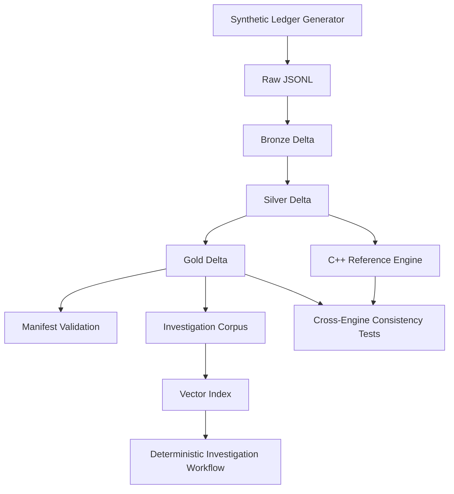

# FinSignal Lakehouse

**Trade–Position Reconciliation & Event Analytics**

FinSignal Lakehouse is a PySpark / Delta Lake batch system for reconciling trades against reported positions. It ingests synthetic trade, price, position, security, and event data through bronze/silver/gold layers, reconstructs expected holdings, classifies reconciliation breaks, validates detections against a ground-truth manifest, and computes bounded event-window metrics around filing-style events.

A small deterministic investigation workflow ranks structured evidence from gold outputs (no LLM generation).

## Core Question

Given raw trades, starting positions, reported positions, prices, and events, can the system:

1. Reconstruct expected positions
2. Compare them against reported positions
3. Detect and classify reconciliation breaks
4. Validate detections against injected ground truth
5. Produce investigation-ready gold-layer outputs

## Architecture



```text
Synthetic Ledger Generator
        │
        ▼
   Raw JSONL              data/raw/        (tracked sample; also regenerable)
        │
        ▼
   Bronze / Silver / Gold  data/{bronze,silver,gold}/   (generated locally; gitignored)
        │
        ├── Manifest Validation (17/17 injected issues, seed 42)
        ├── Cross-Engine Checks (Spark vs Python vs C++)
        └── Investigation Corpus → Vector Index → Deterministic Workflow
```

### Layering

| Layer | Format | Purpose |
|-------|--------|---------|
| **Raw** | JSONL | Simulated API/event payloads from the synthetic ledger generator |
| **Bronze** | Delta (default) / Parquet | Preserve raw fields; add ingestion metadata |
| **Silver** | Delta (default) / Parquet | Schema enforcement, normalization, validation, trade-quality flags |
| **Gold** | Delta (default) / Parquet | Position reconstruction, reconciliation breaks, event-window metrics |

### Reconciliation Logic

v1 uses **checkpointed starting positions** as trusted Day 0 baselines:

```text
expected_position = starting_quantity + cumulative_buys - cumulative_sells
```

It does not reconstruct full account history from inception. Reconciliation runs over a fixed 30-day window.

Stock-split adjustment (`STOCK_SPLIT` only) is applied in silver and used for split-adjustment break classification in gold.

### C++ Reference Engine

Spark owns the batch lakehouse path. The C++20 module in `cpp/` is a **reference implementation** of the same reconciliation core:

- aggregate trades by account / security / date
- reconstruct expected holdings from starting positions
- classify breaks with the same priority rules as gold

It is exposed through pybind11 and parity-tested against a pure-Python reference. At current data scale, correctness parity is the goal; pybind marshalling dominates runtime.

### Storage Portability

I/O is centralized in `src/utils/io.py` (`create_spark_session`, `read_table`, `write_table`). Default format is Delta via `delta-spark`. The same module entry points can be pointed at cloud paths or a Databricks cluster without changing pipeline logic. This repo does not ship Databricks deployment artifacts.

## Data Entities

| Entity | Grain | Description |
|--------|-------|-------------|
| `securities` | 1 row / security | Reference data for tradable instruments |
| `prices` | 1 row / security / date | Daily OHLCV prices |
| `corporate_actions` | 1 row / action | Stock-split actions (`STOCK_SPLIT` only) |
| `starting_positions` | 1 row / account / security / date | Trusted Day 0 checkpoint baselines |
| `trades` | 1 row / trade | Raw trade events with trade and settlement dates |
| `reported_positions` | 1 row / account / security / date | Position snapshots from reporting systems |
| `filing_events` | 1 row / event | Simplified filing-style events for event-window analytics |
| `injected_issues_manifest` | 1 row / issue | Ground truth for intentionally injected data-quality issues |

See [docs/data_model.md](docs/data_model.md) for column definitions and gold outputs.

## Controlled Synthetic Data

The generator builds a clean ledger first, computes true expected positions, copies them into reported positions, then injects known data-quality issues and records them in a manifest.

**v1 scale:** 3 accounts · 5 securities · 30 trading days · 150–300 trades · 17 injected issues (seed 42)

**Injected issue types:** `DUPLICATE_TRADE`, `MISSING_TRADE`, `WRONG_REPORTED_POSITION`, `TIMING_MISMATCH`, `LATE_ARRIVING_TRADE`, `MISSING_PRICE`, `INVALID_SECURITY_ID`, `OUT_OF_ORDER_TRADE_EVENTS`, `SPLIT_ADJUSTMENT_BREAK`

## Status

| Component | Status |
|-----------|--------|
| Synthetic ledger generator | Done |
| Bronze / silver / gold pipelines | Done |
| Manifest validation (17/17, seed 42) | Done |
| Event-window analytics | Done |
| Deterministic investigation + groundedness eval | Done |
| C++ reference engine + parity tests | Done |
| CI (`scripts/run_all.sh`) | Done |

## Repository Layout

```text
FinSignal_Lakehouse/
├── data/raw/                 # Sample seed-42 JSONL (regenerable)
├── docs/                     # Brief, requirements, data model, ADRs, walkthrough
├── src/
│   ├── algorithms/           # Reconciliation, event-window, reference engines
│   ├── data_generation/      # Synthetic ledger generator
│   ├── pipelines/            # Bronze/silver/gold PySpark pipelines
│   ├── retrieval/            # Corpus, index, deterministic workflow, evaluation
│   ├── validation/           # Manifest and cross-engine checks
│   └── utils/                # Spark session and table I/O
├── cpp/                      # C++20 reference engine + pybind11 bindings
├── scripts/                  # run_all, build, benchmark
├── tests/
└── requirements.txt
```

Generated `data/bronze`, `data/silver`, `data/gold`, and `data/retrieval` are local artifacts and are not committed.

## Setup

### Prerequisites

- Python 3.10+
- Java JDK 17 or 21 (PySpark)
- CMake + C++20 compiler (C++ reference engine tests)

On macOS with Homebrew OpenJDK:

```bash
brew install openjdk@17 cmake
export JAVA_HOME="/opt/homebrew/opt/openjdk@17/libexec/openjdk.jdk/Contents/Home"
export PATH="$JAVA_HOME/bin:$PATH"
```

### Install

```bash
python -m venv .venv
source .venv/bin/activate
pip install -r requirements.txt
```

## Quick Start

```bash
bash scripts/run_all.sh
```

Uses seed `42`. Regenerates data, runs pipelines, builds the C++ engine, validates the manifest, and runs pytest.

## Usage

See [docs/demo_walkthrough.md](docs/demo_walkthrough.md) for a full end-to-end walkthrough.

```bash
python -m src.data_generation.generate_ledger --seed 42
python -m src.pipelines.bronze_ingestion --load-id test_load_001
python -m src.pipelines.silver_cleaning --run-id silver_test_001
python -m src.pipelines.gold_reconciliation --run-id gold_recon_001
python -m src.pipelines.gold_event_window --run-id gold_event_001
python -m src.validation.manifest_validation
python -m src.retrieval.build_investigation_corpus --run-id corpus_001
python -m src.retrieval.build_vector_index --run-id vector_001
python -m src.retrieval.investigation_graph --query "Why is there a break for ACC001 SEC002 on 2025-01-20?"
python -m src.retrieval.evaluate_investigation --query "Why is there a break for ACC001 SEC002 on 2025-01-20?"
bash scripts/build_cpp_engine.sh
pytest tests/ -q
```

Override storage with `FINSIGNAL_STORAGE_FORMAT=parquet` if needed.

## Sample Output (Split Break)

For `ACC001 / SEC002 / 2025-01-20`:

```json
{
  "account_id": "ACC001",
  "security_id": "SEC002",
  "position_date": "2025-01-20",
  "expected_position": 382.0,
  "reported_position": 191.0,
  "position_difference": -191.0,
  "break_reason_code": "SPLIT_ADJUSTMENT_BREAK"
}
```

Investigation evaluation returns `groundedness_score: 1.0` for the same key.

## CI

GitHub Actions runs `scripts/run_all.sh` on push/PR.

## Out of Scope

- Databricks / cloud deployment packaging
- Streaming, Kafka, Airflow, Kubernetes
- Trading strategies, prediction, buy/sell recommendations
- Dashboards / UI
- LLM-generated investigation summaries
- Full SEC filing ingestion
- Corporate actions beyond stock splits

## Documentation

- [Demo Walkthrough](docs/demo_walkthrough.md)
- [Project Brief & Scope Lock](docs/project_brief.md)
- [Requirements](docs/requirements.md)
- [Data Model](docs/data_model.md)
- [ADR 001 — Scope Lock](docs/architecture_decisions/001-scope-lock.md)

## License

See [LICENSE](LICENSE).
